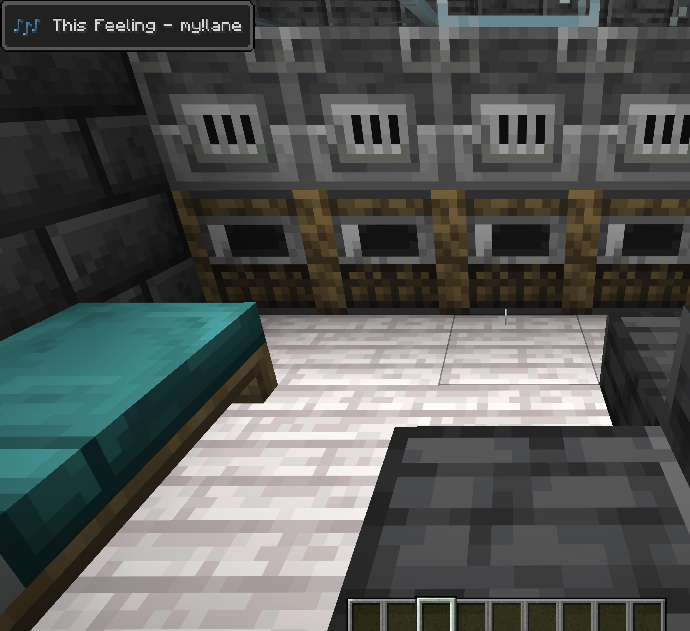
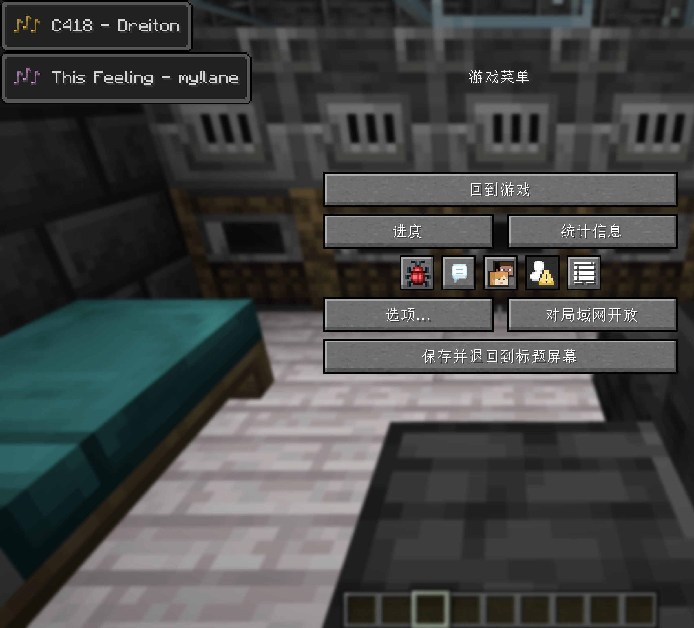

# McMusicToast

> **🌟 公开测试版本 · Public Beta**
>
> 当前版本为**公开测试（Public Beta）**，仍处于公开测试阶段，**可能存在 bug**。
> 欢迎在 Issues 中反馈问题或建议。本项目**完全开源**，可自由查看、学习、修改与分发。
>
> 📖 English version: [README_EN.md](README_EN.md)

---



## 功能特性

- 在「正在播放」弹窗中显示 **Minecraft 原声 / 系统媒体 / 两者**
- **允许的音乐软件**设置：动态检测已安装的媒体软件（音乐 / 浏览器 / 播放器），仅展示已安装项
- 仿「游戏规则」风格的设置界面：搜索框、开关、完成 / 取消
- macOS **隐私与安全性 → 自动化** 授权引导：未授权提示、已拒绝变灰、一键跳转系统设置
- 歌名 / 作者独立截断（各 30 字，超出省略号），无作者时不显示连接符
- 弹窗显示时机（互斥三选一）：音乐信息改变后 / 暂停恢复播放时 / 上一首倒数切歌时
- 暂停恢复弹窗瞬显，模仿原版
- 配置保存在 `.minecraft/config/mcmusic.json`


## 简介

McMusic 是一个 **Minecraft 26.2（Fabric）客户端模组**，它改造游戏原生的「正在播放 / 音乐弹窗（Now Playing Toast）」，并可以**显示系统媒体**（你电脑上正在播放的音乐）。

模组不会自己画一个独立 HUD，而是复用 Minecraft 原生的音乐弹窗体系，因此观感与原版一致。



## 支持的平台

- **Windows 10/11**：通过系统媒体控制（SMTC，PowerShell）读取。
- **macOS**：通过 `nowplaying-cli` 读取系统「正在播放」；并内置 Music.app 的 AppleScript 兜底方案。
- **Linux**：通过 `playerctl` 读取 MPRIS 兼容播放器。

Java / Fabric 部分代码跨平台通用，只有「系统媒体适配器」按操作系统不同。

## 外部依赖（按系统）

- **Windows**：无需额外软件。SMTC 在 Windows 10 1809 及以上可用。
- **macOS**：推荐安装 `nowplaying-cli` 以获得最佳系统级覆盖：
  ```bash
  brew install nowplaying-cli
  ```
  未安装时，兜底方案可读 Music.app。
- **Linux**：安装 `playerctl` 以读取 MPRIS 兼容播放器与浏览器。

## 设置位置

打开：

**Minecraft → 选项 → 音乐与声音 → 音乐弹窗（Music Toast）**

同一界面也可通过 **F8** 打开。

## 构建

本工程针对 **Java 25 / Fabric Loader 0.19.3 / Loom 1.17-SNAPSHOT / Fabric API 0.154.2+26.2** 配置，已内置 Gradle Wrapper。

```bash
./gradlew build
```

构建产物位于 `build/libs/`。

> 直接体验请前往 [Releases](https://github.com/modiange/McMusicToast/releases) 下载编译好的 jar，放入 `mods/` 文件夹即可（需先安装 Fabric Loader 与 Fabric API）。

## 许可

本项目基于 **GPL-3.0 许可证** 开源。详见 [LICENSE](LICENSE)。

## 反馈

中文反馈、bug 报告请到 [Issues](https://github.com/modiange/McMusicToast/issues)。

感谢你参与公开测试！
